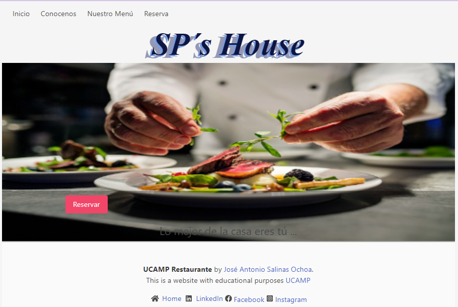
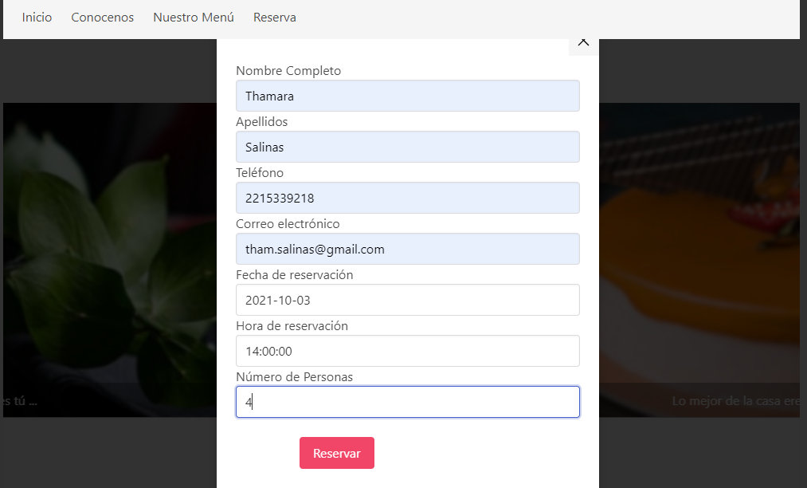
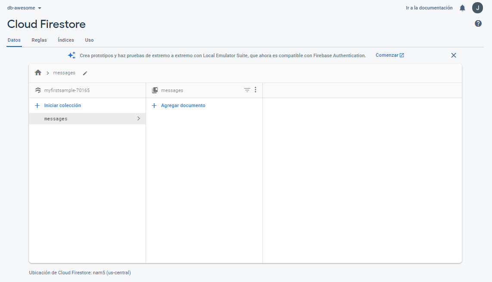
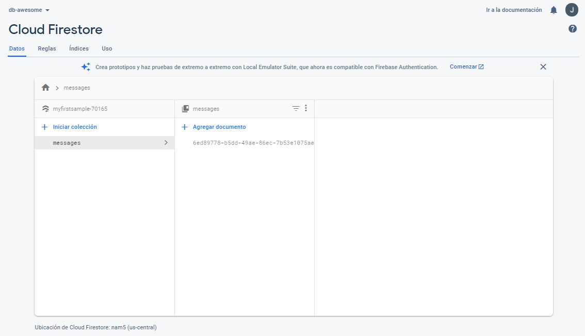
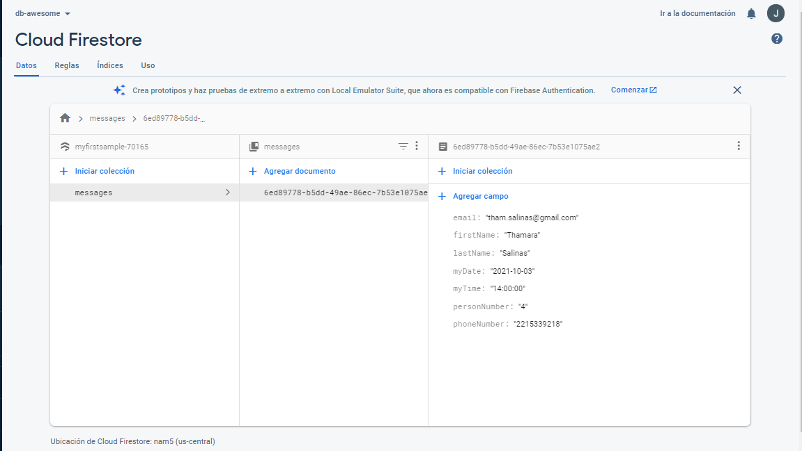

# Restaurante
UCAMP Proyecto 4

# Intro
Desarrollar una aplicación usando React, Firestore database de Google.

# BackEnd
Hacer uso de node para realizar la conexión hacia Firestore database de Google

# FrontEnd
Mostrar Secciones donde se hablé del restaurante, se muestre el menú y la oportunidad de realizar una reservación

# Screenshots
Pantalla inicial del proyecto

Pantalla con menú Reservar

Pantalla Base de Datos Firestore

Pantalla Agregar Documento en Firestore

Pantalla Mostrar Campos de la colección

